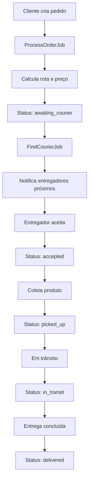

# 📚 Documentação Técnica

## 🏗️ Arquitetura do Sistema

### Camadas da Aplicação

```
┌─────────────────────────────────────────┐
│              FRONTEND                   │
│   (React/Vue + WebSockets + PWA)       │
└─────────────────┬───────────────────────┘
                  │ HTTP/WS
┌─────────────────▼───────────────────────┐
│            API GATEWAY                  │
│  (Nginx + Rate Limiting + Load Balance)│
└─────────────────┬───────────────────────┘
                  │
┌─────────────────▼───────────────────────┐
│         LARAVEL APPLICATION             │
│  ┌─────────────┬─────────────────────┐  │
│  │Controllers  │   Services          │  │
│  │Events       │   Jobs              │  │
│  │Listeners    │   Policies          │  │
│  └─────────────┴─────────────────────┘  │
└─────────────────┬───────────────────────┘
                  │
┌─────────────────▼───────────────────────┐
│           DATA LAYER                    │
│  ┌─────────┬─────────┬─────────────┐    │
│  │  MySQL  │  Redis  │ Meilisearch │    │
│  │ (RDBMS) │(Cache+Q)│   (Search)  │    │
│  └─────────┴─────────┴─────────────┘    │
└─────────────────────────────────────────┘
```

### Fluxo de Pedidos



## 🔄 Jobs e Filas

### Filas Configuradas

1. **orders** (Prioridade: Alta)
   - ProcessOrderJob
   - CalculateRouteJob
   
2. **notifications** (Prioridade: Média)
   - NotifyCourierJob
   - SendCustomerNotificationJob
   
3. **reports** (Prioridade: Baixa)
   - GenerateReportJob
   - ExportOrdersJob

### Eventos e Listeners

```php
// Events
OrderCreated::class -> [ProcessOrderListener::class]
OrderAccepted::class -> [NotifyCustomerListener::class]
OrderDelivered::class -> [UpdateStatsListener::class, SendReceiptListener::class]

// Broadcasting
OrderStatusChanged::class -> WebSocket Channel: order.{orderId}
CourierLocationUpdated::class -> WebSocket Channel: courier.{courierId}
```

## 🔍 Busca e Indexação

### Meilisearch Indexes

```json
{
  "orders": ["order_number", "status", "customer_name", "description"],
  "couriers": ["name", "vehicle_type", "rating"],
  "customers": ["name", "email", "phone"]
}
```

## 📊 Monitoramento

### Métricas Importantes

- **Queue Latency**: Tempo médio de processamento
- **Failed Jobs**: Taxa de falha por fila
- **API Response Time**: P95, P99
- **Database Queries**: Slow queries > 100ms
- **Redis Memory**: Uso de memória
- **Active WebSocket Connections**: Conexões simultâneas

### Health Checks

```bash
# Verificar status dos serviços
curl http://localhost/health

# Response esperado
{
  "status": "healthy",
  "services": {
    "database": "up",
    "redis": "up", 
    "meilisearch": "up",
    "horizon": "running"
  }
}
```
